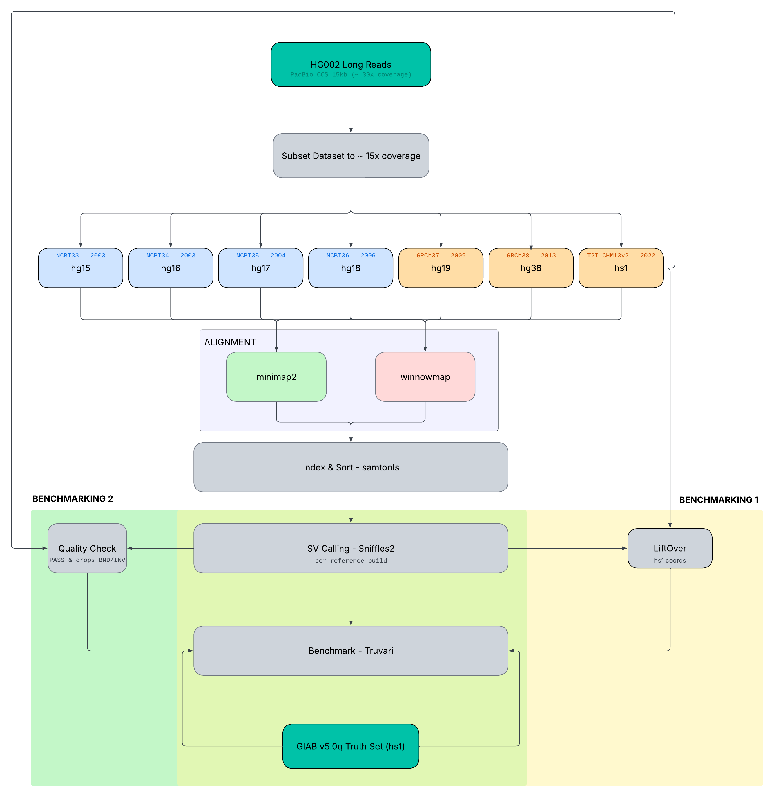
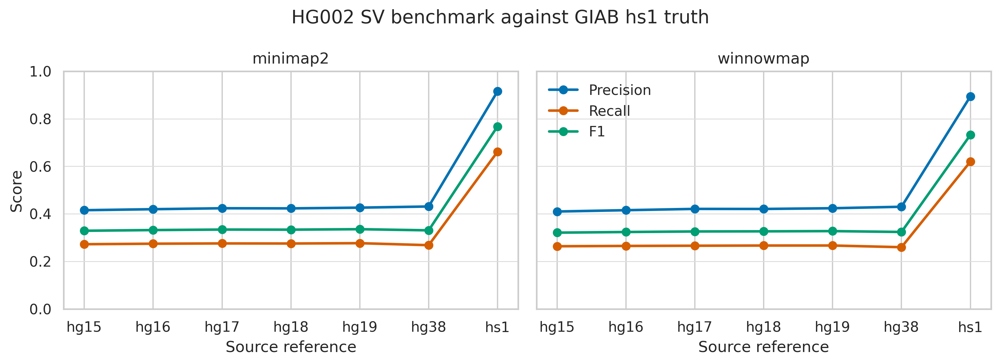
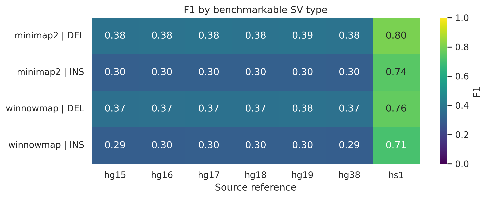
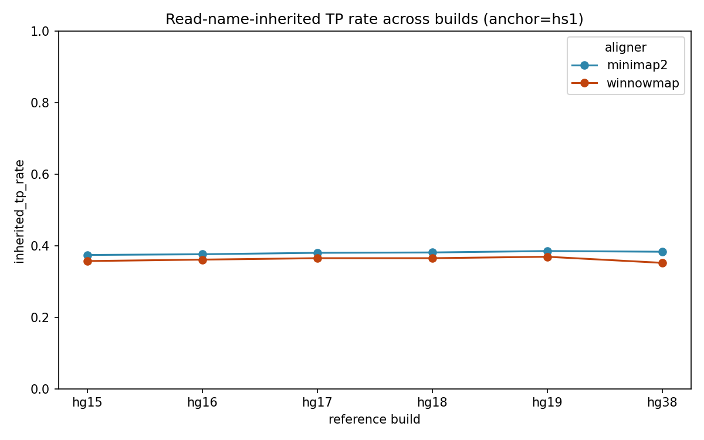
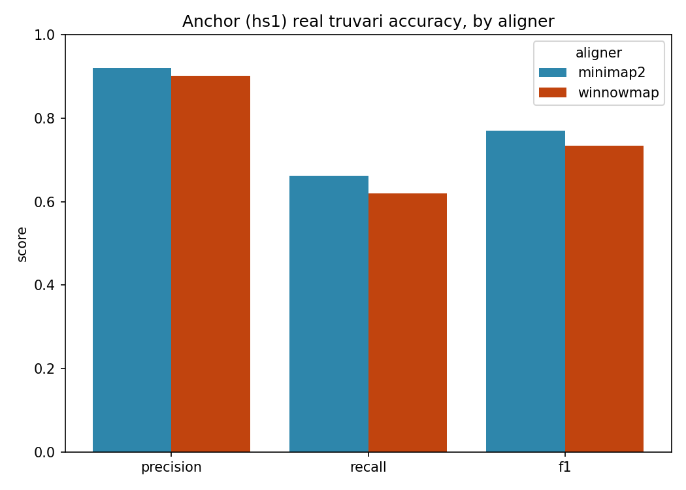

# Benchmarking the Impact of Reference Genome Quality on SV Discovery

## Research Focus
> How much of the SV callset changes as the reference assembly improves from an early draft (hg15) to a complete telomere-to-telomere assembly (T2T-CHM13) and what fraction of that change can be measured directly?

## Background

Structural variant detection is always relative to a reference assembly, and while humans now have a complete telomere-to-telomere reference, most species are stuck with fragmented draft assemblies. Researchers calling SVs against such drafts have no principled way to know what their callset is missing. Therefore, we would like to systematically investigate how assembly quality influences SV calling.

## Methods  
### **Reference Genome Assemblies**  
7 reference genome assemblies, spanning the history of the human genome reference from its first public draft to the current telomere-to-telomere assembly, were used:
- hg15 (2003)
- hg16 (NCBI34, 2003)
- hg17 (NCBI35, 2004)
- hg18 (NCBI36, 2006)
- hg19 (GRCh37, 2009)
- hg38 (GRCh38, 2013)
- hs1 (T2T-CHM13 v2.0, 2022)

### **1. Subsample Benchmark Sample**   
Our current workflow only consists of the benchmark sample HG002 from the PacBio CCS long-reads 15kb (~30x coverage). Which was then subsampled deterministically prior to alignment, to ~15x rather than the full 30x, primarily to reduce runtime across 7 reference builds x 2 aligners.

### **2. Read Alignment**  
Reads were aligned to each reference build independently using 2 long-read aligners, run in parallel: **Winnowmap** and **minimap2**.  

- **Winnowmap**: a repetitive k-mer list was pre-computed for each reference build with Meryl and supplied via `-W` flag and alignment was run with `-ax map-pb` preset
- **minimap2**: alignment was run with the `-ax map-hifi` preset, intended for CCS/HiFi data  

Both aligners were run genome-wide to avoid displacing reads that align more accurately elsewhere in the genome onto the target regions, which would display false structural-variant signal. Alignments were coordinate-sorted and indexed with samtools.  

### **4. Sort and Index - samtools**  
Sorted and indexed the aligned reads using samtools

### **5. Structural Variant Calling - Sniffles2**  
Structural variants were called from each whole-genome alignment using Sniffles2 using the following parameter: `--minsvlen 50`, and produced 1 VCF and 1 SNF file per reference build x aligner combination.  

### **6. Benchmarking - Truvari**
#### **6.1 Using LiftOver**
HG002 truth set for the hs1 reference genome was downloaded from the Genome in a Bottle (GIAB). Each of the Sniffles callset, except the hs1, were lifted to the hs1 coordinates. The callsets were then inputted into Truvari, with the HG002 truth set for the hs1 reference genome. The results can be found in `figures/benchmark_liftover`.  

#### **6.2 Using RNAMES from Sniffles**
The anchor chosen for the benchmarking process is hs1, since it has a native GIAB truth set. The Sniffle calls were all PASS calls and BND/INV labels were dropped. The hs1 callset was scored against the truth sets. The non-anchor build callset inherited a TP label by the matching read names from Sniffle against the classified TP as long as the OVERLAP_min is 0.5. The results can be found in `figures/benchmark_rnames`.

## Tools Used:
| Tool | Version |
| :--- | :--- |
| winnowmap | 2.03 |
| meryl | 1.4.2 |
| sniffles2 | 2.8.0 |
| minimap2 |  |
| samtools | 1.24 |
| rasusa |  |
| szstd |  |
| LiftOver |  |

## Workflow Diagram [in-works]



## Results
### Benchmarking - LiftOver
The results show that the choice of reference assembly had a much greater influence on SV benchmarking than the choice of mapper. Callsets generated directly against hs1 agreed substantially better with the hs1-based HG002 truth set than callsets generated against older references and subsequently lifted to hs1, while minimap2 performed only modestly better than Winnowmap. Among the older assemblies, performance was broadly similar and did not improve consistently with assembly recency, suggesting that coordinate projection and reference-specific sequence differences dominate over the historical ordering of the builds. Deletions were generally recovered more reliably than insertions, and performance declined for longer SVs, particularly very large events. The strict common mask retained most benchmark-region bases but excluded a disproportionately large fraction of SVs, especially long events and false negatives, showing that excluded regions are much more difficult and structurally variable than the genome average. Relaxing full-event containment to endpoint containment recovered additional variants without materially changing the enrichment patterns, indicating that the principal conclusions are robust to reasonable changes in mask definition. Across true positives, false positives and false negatives, SVs were consistently concentrated in simple repeats, low-complexity sequence, satellites, segmental duplications and low-mappability regions, while coding and actively transcribed regions were generally depleted. Most SV clusters were either shared across nearly all references or confined to a single reference, with relatively few showing intermediate sharing. Reference-specific and partially shared clusters were particularly associated with segmental duplications and low-mappability sequence, whereas repeat enrichment remained evident across most sharing classes. Overall, the analysis indicates that difficult repetitive sequence and cross-assembly coordinate compatibility are the principal determinants of SV reproducibility, while mapper choice has a smaller effect; the strong hs1 result should therefore be interpreted as a combination of improved reference representation and the absence of liftover and truth-coordinate mismatch, rather than solely as superior mapping performance.

  

### Benchmarking - RNames
Under the read-name-tracing benchmark, only the anchor build (hs1) was scored directly against the native GIAB v5.0q truth set via Truvari, yielding precision/recall/F1 of 0.92/0.66/0.77 for minimap2 and 0.90/0.62/0.73 for winnowmap (TP-base = 15,938 and 14,934). The remaining six builds (hg15–hg38) were not compared to the truth set directly. Instead, each build's SV calls were evaluated for supporting-read overlap with hs1's own Truvari-confirmed true positives, yielding an "inherited TP rate" rather than a true recall. This rate remained essentially flat across the reference ladder for both aligners (minimap2: 0.374–0.385; winnowmap: 0.352–0.369), with no discernible trend by assembly release year, in contrast to the pronounced recall degradation observed for older builds under the liftover-based Truvari benchmark. Of each build's roughly 22,000–23,000 SV calls, only 6–7% were excluded for an SVTYPE mismatch with candidate anchor calls, while the majority (55–59%) shared no supporting reads with any anchor true positive at all and were therefore left unclassified rather than labeled false positives, since this method has no mechanism for assigning a false-positive rate to non-anchor builds. Taken together, these results indicate that read-name-based cross-build matching is substantially less sensitive to reference assembly quality than coordinate-based benchmarking, likely because requiring literal read-identity overlap with a single anchor's call is a considerably stricter and more indirect criterion than comparing lifted coordinates directly against ground truth. A limitation that should be weighed against the method's key advantage of never requiring coordinate transformation across assembly builds.

  

```text
build    n_calls    n_inherited_tp    inherited_tp_rate
hg15      23220      8682                  37.4%
hg16      23119      8692                  37.6%
hg17      22965      8732                  38%
hg18      22941      8740                  38.1%
hg19      22821      8795                  38.5%
hg38      22017      8442                  38.3%   
```

### SV Discovery App

A structural variant (SV) discovery tool that runs on DNAnexus and provides a web-based interface for uploading long-read sequencing data, running SV calling, and visualizing results.

This project has two components:

- **`sv_discovery_app/`** — a DNAnexus applet that runs [SV caller name, 
  e.g. pbsv/Sniffles/cuteSV] on aligned long-read BAM files to detect 
  structural variants (insertions, deletions, duplications, etc.).
- **`sv_discovery_webapp/`** — a Streamlit web interface that lets a user 
  upload/select sequencing data, trigger the DNAnexus applet, and view 
  the resulting SV calls (e.g., as a table/VCF viewer or plot).

The pipeline was tested using PacBio HiFi CCS 15kb long reads from the 
HG002 GIAB reference sample, aligned to GRCh38, subset to the *FLG* gene 
region (chr1:152,302,165–152,325,239) — a repetitive, structurally 
complex locus useful for stress-testing SV callers.

## Prerequisites

- A [DNAnexus](https://www.dnanexus.com/) account with access to this project
- Python 3.10 installed
- `dx` CLI tool (`pip install dxpy`) — [setup guide](https://documentation.dnanexus.com/getting-started)
- Logged in via `dx login`, with SSH keys set up (`dx generate_ssh_key`) if 
  running/debugging on a Cloud Workstation
- Install the Streamlit library

## Usage

1. Open the Streamlit app in your browser (usually `http://localhost:8501`)
2. Upload a FASTQ/BAM file, or select one already in your DNAnexus project
3. [Describe: click "Run SV discovery", select reference build, etc.]
4. View results: [describe what the output looks like — table of SVs? VCF download? plot?]

# examples


## Limitations

This is a demo/prototype built for a hackathon, and comes with several 
known constraints:

- **Dataset scope**: The app currently only has access to data included 
  in the group project — the HG002 (GIAB) reference sample. It has not 
  been tested against other samples or datasets.

- **Sample size / runtime**: Due to processing time, only small read 
  subsets can practically be tested. For example, a 100-read sample takes 
  approximately 5 minutes to run end-to-end. Larger samples (e.g., 
  whole-chromosome or whole-genome scale) were not tested and would 
  require significantly longer runtimes.

- **Platform dependency**: The app is exclusive to users with a DNAnexus 
  account, since the SV discovery step relies on DNAnexus's cloud 
  computing platform to run. It cannot currently be run fully offline or 
  without platform access.


## Members
| Team member | Role |
| :--- | :--- |
| **Susanne Pfeifer** | Group Leader |
| Alisa Iakupova | Pipeline Implementation |
| Daniil Khlebnikov | Pipeline Implementation |
| German Demidov | Pipeline Implementation |
| Miguel Angel Trejo Acosta | Pipeline Implementation & Website Demo Builder |
| Steven Chen | Pipeline Implementation & AI Wrapper |
| Tammy Sisodiya | Pipeline Implementation & Writer |
| Vy Dang | Pipeline Implementation & GitHub |
| Yunjia Liu | Pipeline Implementation & Writer |

## References
Smolka, M., Paulin, L.F., Grochowski, C.M. et al. Detection of mosaic and population-level structural variants with Sniffles2. Nat Biotechnol 42, 1571–1580 (2024). https://doi.org/10.1038/s41587-023-02024-y

## Future Implementation
- To help researchers on
